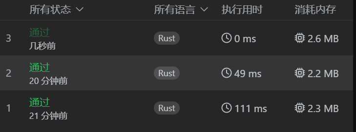

# 1. 两数之和

使用 HashMap，将时间复杂度降低到 O(1)
```rust
pub fn two_sum(nums: Vec<i32>, target: i32) -> Vec<i32> {
    use std::collections::HashMap;
    let mut map: HashMap<&i32,i32> = HashMap::new();
    let len = nums.len();
    let mut res: Vec<i32> = vec![];
    for i in 0..=len-1 {
        match map.get(&(target - nums[i]))
        {
            Some(v) => {
                res.push(i as i32);
                res.push(*v as i32);
                return res;
            }
            None => { map.insert(&nums[i],i); }
        }
    }
    [0,0].into()
}
```

# d1.每日一题：2874.有序三元组中的最大值 II
请你从所有满足 i < j < k 的下标三元组 (i, j, k) 中，找出并返回下标三元组的最大值。
下标三元组 (i, j, k) 的值等于 (nums[i] - nums[j]) * nums[k] 。

```rust
    pub fn maximum_triplet_value(nums: Vec<i32>) -> i64 {
        let len = nums.len();
        let mut l_max = vec![0; len];
        let mut r_max = vec![0; len];

        for i in 1..=len-1{
            l_max[i] = l_max[i-1].max(nums[i-1]);
            r_max[len-i-1] = r_max[len-i].max(nums[len-i]);
        }
        let mut res = 0;
        for j in 1..=len-2 {
            res = res.max((l_max[j]-nums[j]) as i64 * r_max[j] as i64);
        }
        res
    }
```
思路： 给定一个 j ，需要 i 和 k 对应的值越大越好。开辟两个数组，存储每个位置左右的最大值。比较每个位置的结果，
即可得到结果。

时间复杂度： O(n) ~= 2n

# 2. 两数相加

算法简单，注意 rust 数据结构的使用方法。
```rust
#[derive(PartialEq, Eq, Clone, Debug)]
pub struct ListNode {
    pub val: i32,
    pub next: Option<Box<ListNode>>
}

impl ListNode {
    #[inline]
    fn new(val: i32) -> Self {
        ListNode {
            next: None,
            val
        }
    }
}
impl Solution {
    pub fn add_two_numbers(l1: Option<Box<ListNode>>, l2: Option<Box<ListNode>>) -> Option<Box<ListNode>> {
        let mut dummy = Box::new(ListNode::new(0));
        let mut curr = &mut dummy.next;
        let mut addition = 0;

        let (mut l1, mut l2) = (l1, l2);

        while l1.is_some() || l2.is_some() || addition > 0 {
            let val1 = l1.as_ref().map_or(0, |n| n.val);
            let val2 = l2.as_ref().map_or(0, |n| n.val);
            // 下面这段代码功能和上面两行相等，rust的函数式编程比较简便
            // let mut val1 = 0;
            // let mut val2 = 0;
            // match l1 { 
            //     Some(ref v1) => {
            //         val1 = v1.val;
            //     }
            //     None => {}
            // }
            // match l2 {
            //     Some(ref v2) => {
            //         val2 = v2.val;
            //     }
            //     None => {}
            // }
            
            let sum = val1 + val2 + addition;

            addition = sum / 10;
            *curr = Some(Box::new(ListNode::new(sum % 10)));
            curr = &mut curr.as_mut().unwrap().next;

            l1 = l1.and_then(|node|node.next);
            l2 = l2.and_then(|node|node.next);

        }
        dummy.next
    }
}
```


# d2.每日一题：1123. 最深叶节点的最近公共祖先

```rust
#[derive(Debug, PartialEq, Eq)]
pub struct TreeNode {
    pub val: i32,
    pub left: Option<Rc<RefCell<TreeNode>>>,
    pub right: Option<Rc<RefCell<TreeNode>>>,
}

impl TreeNode {
    #[inline]
    pub fn new(val: i32) -> Self {
        TreeNode {
            val,
            left: None,
            right: None
        }
    }
}

use std::rc::Rc;
use std::cell::RefCell;
impl Solution {
    pub fn f(root: Option<Rc<RefCell<TreeNode>>>) -> (Option<Rc<RefCell<TreeNode>>>,i32) {
        if root.is_none() {
            return (root,0);
        }
        let (l_r,l_ret) = Solution::f(root.as_ref().unwrap().borrow().left.clone());
        let (r_r,r_ret) = Solution::f(root.as_ref().unwrap().borrow().right.clone());
        if l_ret > r_ret {
            return (l_r, l_ret+1);
        }
        if r_ret > l_ret {
            return (r_r, r_ret+1);
        }
        return (root, l_ret+1);
    }

    pub fn lca_deepest_leaves(root: Option<Rc<RefCell<TreeNode>>>) -> Option<Rc<RefCell<TreeNode>>> {
        // 算法1： 不符合树的结构
        // 1. 找到最深的叶节点
        // 2. 合并查找他们的父节点，在查找父节点的父节点，直到只有最后一个父节点为止。
        // 3. 返回以这个父节点即可。（函数要求）

        // 算法2： 递归 ---> 可行
        // 1. 深度优先搜索，对树中的每个节点进行递归，返回当前子树的最大深度 d 和 lca 节点。如果当前节点为空，我们返回深度 0 和空节点。
        // 2. 比较左右子树的深度：
        //         如果左子树更深，最深叶节点在左子树中，我们返回 {左子树深度 + 1，左子树的 lca 节点}
        //         如果右子树更深，最深叶节点在右子树中，我们返回 {右子树深度 + 1，右子树的 lca 节点}
        //         如果左右子树一样深，左右子树都有最深叶节点，我们返回 {左子树深度 + 1，当前节点}
        let (l,r) = Solution::f(root);
        l
    }
}
```


# 3. 无重复字符的最长子串

滑动窗口算法。（应该有可以优化的算法？？？或者该算法中有可以优化的地方？？）
```rust
impl Solution {
     pub fn length_of_longest_substring(s: String) -> i32 {
        use std::collections::HashMap;
        let mut hash_map = HashMap::new();
        let len = s.len();
        if len==0{
            return 0i32;
        }
        let mut max = 1;

        let mut idx_l = 0;
        let mut idx_r = 0;
        // 滑动窗口 [l..r]
        while idx_l < len && idx_r < len && idx_l <= idx_r {
            if idx_r == len {
                break;
            }
            let c = s.chars().nth(idx_r).unwrap();
            if hash_map.contains_key(&c) {
                hash_map.remove(&s.chars().nth(idx_l).unwrap());
                idx_l = idx_l + 1;
                continue;
            } else {
                hash_map.insert(s.chars().nth(idx_r).unwrap(), 1);
                max = max.max(hash_map.len());
            }
            // 向右滑动 1 位
            idx_r += 1;
        }
        max as i32
    }
}
```

# d3.每日一题：1863. 找出所有子集的异或总和再求和


## 1. 递归实现
idx的结果取决于 idx-1 的结果，每个为止是否选取构成所有子集。
```rust
impl Solution {
    pub fn subset_xor_sum(nums: Vec<i32>) -> i32 {
        fn dfs(val: i32, idx: usize,nums: &[i32]) -> i32 {
            if idx == nums.len() {
                // 枚举了所有子集的结果，返回即可
                return val;
            }
            // 选取当前为止的元素和不选取当前为止的元素返回之和
            dfs(val ^ nums[idx],idx+1,nums) + dfs(val,idx+1,nums)
        }
        dfs(0,0,&nums)
    }
}
```

## 2. 枚举实现
每个长度为 n 的数组有 2^n 个子集，将其映射到 [0 .. 2^n] 的数组上，数组中每个数字的 bit 表示当前 idx 是否被选择。
```rust
impl Solution {
    pub fn subset_xor_sum(nums: Vec<i32>) -> i32 {
        let mut res = 0;
        let len = nums.len();

        for i in 0..(1<<len) {
            let mut tmp = 0;
            for j in 0..len {
                if (i & (1<<j) )!=0 {
                    // 当前idx，就是j，被选择
                    tmp ^= nums[j];
                }
            }
            // 加和
            res += tmp;
        }
        res
    }
}
```

